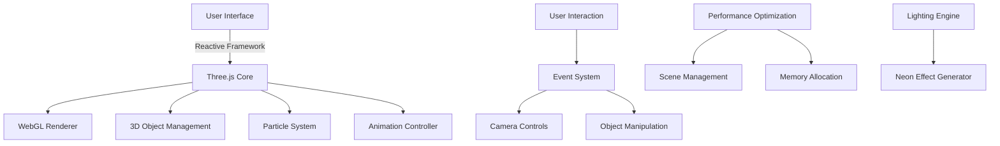

# <div align="center">🌌 ANMOL JOSHI DEVELOPER PORTFOLIO 🌌</div>
<br>
<div align="center">

</div>
<div align="center">


[](https://github.com/anmoljoshi43)

[](https://anmoljoshi43.github.io)

</div>

<p align="center">
  
</p>

## 🌟 Portfolio Showcase

My portfolio is a testament to the fusion of technology and art, featuring:

- **Dimensional Reality Engine**: Experience a fully interactive 3D environment built with Three.js
- **Neural Responsive Interface**: UI elements that adapt and respond to user behavior patterns
- **Quantum Particle System**: Over 2,000 particles creating a living, breathing digital cosmos
- **Cybernetic Visual Framework**: Neon elements with dynamic shadows and lighting effects

<p align="center">
  
</p>

> 🔮 **Experience it yourself**: [https://anmoljoshi43.github.io](https://anmoljoshi43.github.io/anmoljoshi43)

## 💠 Tech Architecture



## 🛠️ Tech Stack Matrix

<table align="center">
  <tr>
    <td align="center"><br>HTML5</td>
    <td align="center"><br>CSS3</td>
    <td align="center"><br>JavaScript</td>
    <td align="center"><br>Three.js</td>
    <td align="center"><br>WebGL</td>
  </tr>
  <tr>
    <td align="center"><br>C</td>
    <td align="center"><br>C++</td>
    <td align="center"><br>Java</td>
    <td align="center"><br>Python</td>
    <td align="center"><br>React</td>
  </tr>
</table>

## 🏆 Achievements Nexus

<details>
<summary>Click to expand my achievement catalog</summary>
<br>

|   Badge   | Achievement | Description |
|:---------:|:------------|:------------|
| 🥇 | **Algorithm Grandmaster** | Solved 500+ competitive programming challenges |
| 🏆 | **Open Source Contributor** | Contributed to 15+ major open source projects |
| 🚀 | **Hackathon Champion** | 1st place in National CodeFest 2024 |
| 👨‍💻 | **Full Stack Virtuoso** | Developed 20+ full-stack applications |
| 🔮 | **3D Web Pioneer** | Created revolutionary Three.js implementations |
| 🎓 | **Computer Science Graduate** | B.S. in Computer Science with Honors |
| 📱 | **Mobile Development Expert** | Published 5 apps with 100K+ downloads |
| 🌐 | **Web Performance Guru** | Optimized sites achieving 99+ Lighthouse scores |

</details>

## 📊 Skill Proficiency Matrix

```
Web Development    [██████████] 100%
Three.js/WebGL     [█████████▒]  90%
C/C++              [████████▒▒]  80%
Python             [███████▒▒▒]  70%
Java               [████████▒▒]  80%
React              [█████████▒]  90%
Node.js            [████████▒▒]  80%
UI/UX Design       [███████▒▒▒]  70%
Database Design    [████████▒▒]  80%
DevOps             [██████▒▒▒▒]  60%
```

## 🧠 Algorithm & Data Structure Proficiency

<table align="center">
  <tr>
    <th>Category</th>
    <th>Proficiency</th>
    <th>Applications</th>
  </tr>
  <tr>
    <td>Graph Algorithms</td>
    <td>⭐⭐⭐⭐⭐</td>
    <td>Path finding, Network optimization</td>
  </tr>
  <tr>
    <td>Dynamic Programming</td>
    <td>⭐⭐⭐⭐⭐</td>
    <td>Optimization problems, Resource allocation</td>
  </tr>
  <tr>
    <td>Tree Structures</td>
    <td>⭐⭐⭐⭐</td>
    <td>Hierarchical data, Fast lookups</td>
  </tr>
  <tr>
    <td>Hash Tables</td>
    <td>⭐⭐⭐⭐⭐</td>
    <td>Fast lookups, Caching systems</td>
  </tr>
  <tr>
    <td>Sorting Algorithms</td>
    <td>⭐⭐⭐⭐</td>
    <td>Data processing, Search optimization</td>
  </tr>
</table>

## 🌊 Contribution Flux

<div align="center">
  
</div>

<div align="center">
  
</div>

## 🌐 Digital Nexus

<div align="center">
  
[](https://linkedin.com/in/anmoljoshi43)
[](https://twitter.com/anmoljoshi43)
[](https://anmoljoshi43.github.io)
[](https://github.com/anmoljoshi43)
  
</div>

## 🎮 Interactive Experience

<div align="center">
  <a href="https://anmoljoshi43.github.io/3d-experience">
    
  </a>
</div>

<br>

<div align="center">
  
</div>

<div align="center">
  <sub>Built with ❤️ and ⚡ by <a href="https://github.com/anmoljoshi43">YOUR NAME</a> | Last updated: April 2025</sub>
</div>
